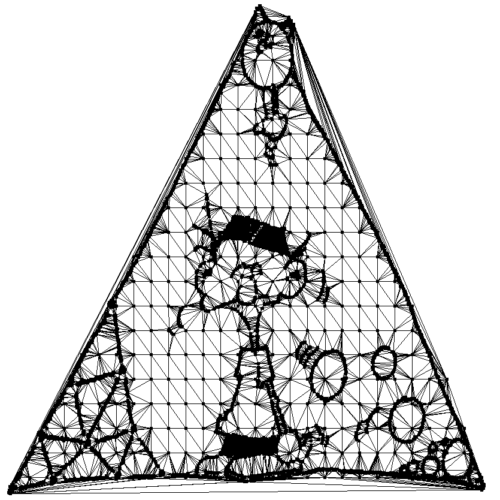
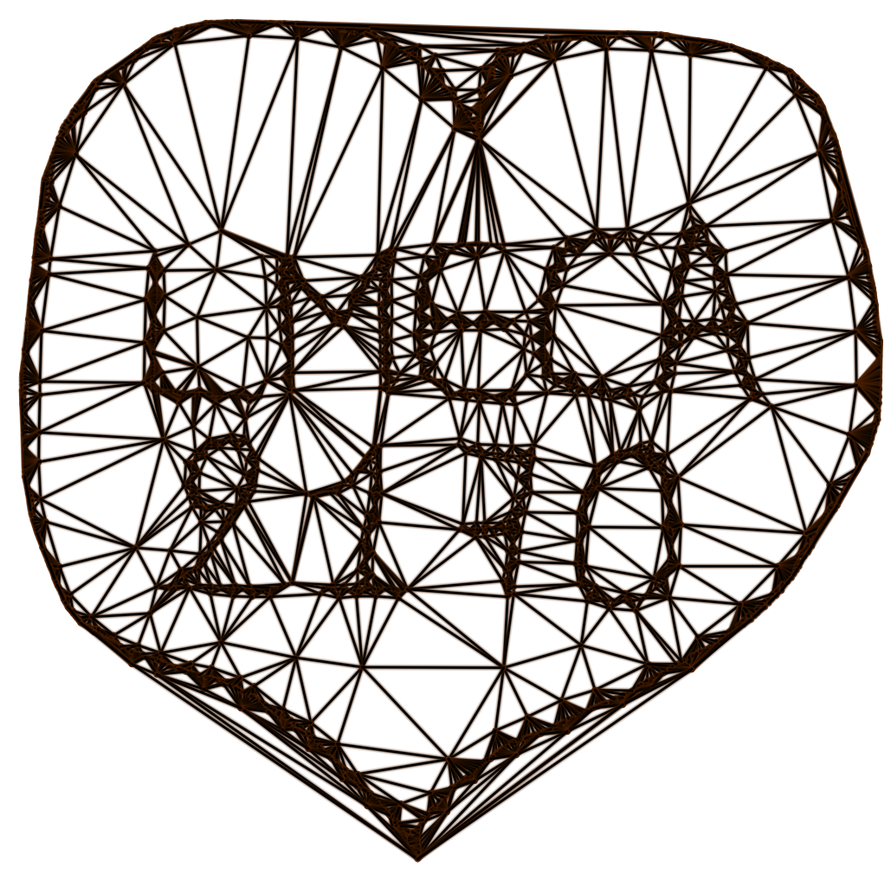
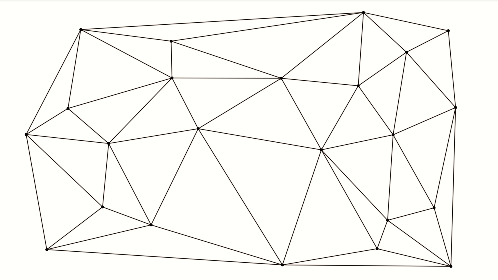

# Numerical Geometry Project

- Author: Jérome Eertmans (13551600)
- Course: Numerical Geometries (LMECA2710)
- Algorithm: Delaunay triangulation

<p align="center"> </p>

## How to use this project

If you want to use the project, you need to first compile it:

```
mkdir build     # only required once
cd build
cmake ..        # only required once
make
cd ..
```

Alternatively, you can use `./buid.sh` if you are on a UNIX machine (please first create the directory and instantiate the cmake).

Then you can execute the program. A variety of parameters is available, please use `-h` flag to see them.
```
./build/bin/lmeca2710_project [-param value] ...
```


**However**, I **highly** recommend you to use my Python wrapper, as it adds
very nice sound effects!

What you need:
 - A Python3 installation
 - 2 small Python packages (use: `pip3 install -r requirements.txt`)

Then, you can use the produce the exact same results + some bonuses:
```
python3 main.py [-param value] ...
```

You can also modify the music theme in `main.py`.

**Warning**: key bindings assume you have an AZERTY layout. If your keyboard layout differs, please transpose the keys accordingly.
Example: pressing *Q* on a QWERTY layout will be understood as the key *A*.

## Drawing images with triangulation

Some funny images can be generated by triangulating very specific sets of points.
Please have a look into the *input* folder.

The drawings data files were kindly generated by Pierre Veldeman using some public image found on the internet.

I edited some files manually to show you what you can do with this program.


<p align="center"> </p>

<p align="center"> &nbsp;</p>

## Voronoi diagrams

From a given Delaunay triangulation, it is trivial to construct the equivalent  Voronoi diagram.
Such a possibility is provided by the program.

**Nonetheless**, the semi-infinite lines were omitted for drawing purposes. This program is meant to be fast
and drawing semi-infinite lines cannot be done efficiently because it has to be recomputed whenever you move the window.
So, indeed, the Voronoi diagram is not complete.

## YOUPIDOU mode

If you happen know the Pr. Vincent Legat, then you should for sure have a look to the YOUPIDOU mode
of execution using the `-y` flag with Python.

Sound files have been kindly provided by the [Youpidapp](https://github.com/TGLuis/Youpidapp)
authors. If you happen to have an Android phone, make sure to try their app!

All these sounds files are the property of Vincent Legat and were obtained from
his [Youtube channel](https://www.youtube.com/channel/UC-QAurzK1czAlnMFOqkfxfw).

## Known issues

### Memory issues

In the GUI, using the SHIFT + KEY (i.e. fast repeat of KEY) can cause memory problems if used for too long.

This is the case when Voronoi and pretty drawings are activated, and that you try to
quickly delete a lot of points.

After having a look at memory leaks with Valgrind, it seems like the memory problems
may come from the BOV library, a library provided for the course. My code, in its own, is
Memcheck clean as it does not leak anything when used with `-d` flag.

### `ALSA lib pcm.c:8526:(snd_pcm_recover) underrun occurred`

You can ignore this error, it just happens because you closed the application when a new sound
file was just starting to be played.

## Sound bibliography

All the musics are Copyright Free songs.
If you wan to reuse them, please make sure to keep it as a private usage.

Sound effects:
http://soundbible.com

Synthwave theme:
https://www.youtube.com/watch?v=onEyXlpdY3U

Chill theme:
https://incompetech.com/music/royalty-free/index.html?isrc=USUAN1100326

## Guides

This folder is the canvas for your upcoming project.
It should contain:
 * this file (**README.md**)
 * the description of the structure of the program in **CMakeLists.txt**
 * a **src** directory containing the the source code of your program
 * a **doc** directory containing more documentation
 * a **deps** directory containing the BOV library

See [doc/COMPILING.md](doc/COMPILING.md) for a step by step tutorial
on how to build the program.

See [doc/tutorial.md](doc/tutorial.md) for a step by step tutorial on
how to use the BOV library.

See [deps/BOV/include/BOV.h](deps/BOV/include/BOV.h)
for help on the BOV library functions.

See [deps/BOV/examples/](deps/BOV/examples/) for more
examples using the BOV library
