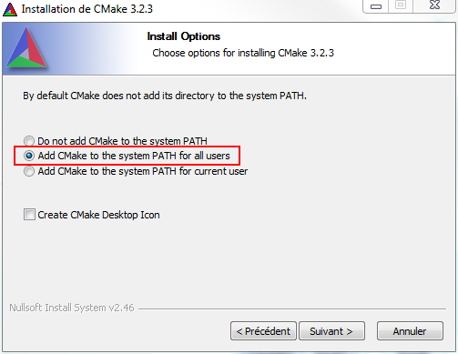
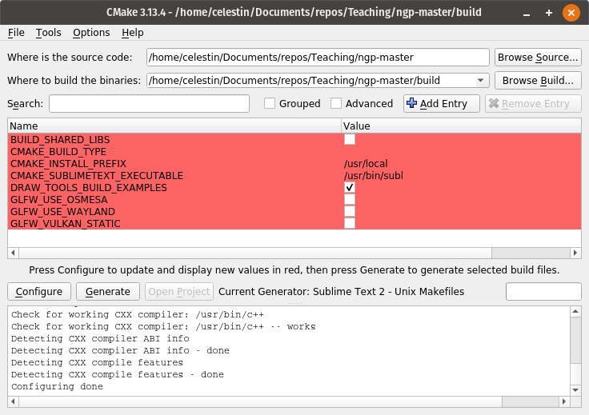

Compiling and running
=====================

This project uses CMake to generate the build tools required to compile the code
into an executable binary file `bin/myexec`. CMake can create a Makefile or a
project file for you favorite IDE.

We will call CMake in a directory called **build**, where all the compilation
files and IDE-related stuff will be.
The project itself, which is contained in the **src** and **deps** folders will
stay clean. If you have any issue with the procedure explained below, just
remove everything in the **build** directory and try again !

 * [Instruction for Ubuntu](#on-ubuntu)
 * [Instruction for MacOS](#on-macos)
 * [Instruction for Windows](#on-windows)

 

## on Ubuntu

#### Learning to use the terminal !

If you don't know how to use a terminal, how to change directories within a
terminal etc. see [the tutorial on using the terminal](doc/terminal_tutorial.md)

#### Installing dependencies:

    sudo apt-get install cmake xorg-dev libglu1-mesa-dev

Optionally, you can also install `cmake-qt-gui` or `cmake-curses-gui` for a
graphical user interface (GUI) to CMake. You will then use `cmake-gui` or
`ccmake` instead of `cmake` to use the GUI.

#### Compiling:

 1. Create the Makefile (do this only once):

        mkdir build   # Creates the build directory
        cd build      # Go into the build directory
        cmake ..      # Call CMake with the top-level directory as argument (`..` is the parent directory)

    Instead of using `cmake ..` to generate a Makefile, you can also build
    project for Visual Studio, XCode, Sublime-Text, CodeBlocks, Eclipse... using
    `cmake -G GENERATOR_NAME ..` .
    [Available generators](https://cmake.org/cmake/help/v3.13/manual/cmake-generators.7.html#cmake-generators-7) are listed with `cmake --help`

    Alternatively, if you installed a CMake GUI, you can also follow
    [the part of the windows instruction](#creating-a-visual-studio-project-using-cmake)
    concerning CMake, which basically work the same.

 2. Compile the program into an executable (do this every time you changed a file)* :

         make

    *If you created a project file for an IDE instead of a makefile (if you used
     `cmake -G GENERATOR_NAME ..`), this step will not work. Normally, in an IDE,
     running the project will automatically compiles the code.

#### Running:

 Again, if you are not using an IDE:

    ./bin/myexec

 

## on MacOS

#### Learning to use the terminal !

If you don't know how to use a terminal, how to change directories within a
terminal etc. see [the tutorial on using the terminal](doc/terminal_tutorial.md)

**Installing dependencies:**

 1. Install XCode
 2. Install CMake
    * Install: https://cmake.org/files/v3.13/cmake-3.13.0-rc1-Darwin-x86_64.dmg
    * Enable to use `cmake` as a command line :

            sudo "/Applications/CMake.app/Contents/bin/cmake-gui" --install

    * If the installation was successfull, the following command should return
      the path to the cmake program

            which cmake

#### Compiling:

 1. Create the Makefile (do this only once):

        mkdir build   # Creates the build directory
        cd build      # Go into the build directory
        cmake ..      # Call CMake with the top-level directory as argument (`..` is the parent directory)

    Instead of using `cmake ..` to generate a Makefile, you can also build
    project for Visual Studio, XCode, Sublime-Text, CodeBlocks, Eclipse... using
    `cmake -G GENERATOR_NAME ..` .
    [Available generators](https://cmake.org/cmake/help/v3.13/manual/cmake-generators.7.html#cmake-generators-7)
    are listed with `cmake --help`

 2. Compile the program into an executable (do this every time you changed a file)* :

        make

    *If you created a project file for an IDE instead of a makefile (if you used
     `cmake -G GENERATOR_NAME ..`), this step will not work. Normally, in an IDE,
     running the project will automatically compiles the code.

#### Running:

 Again, if you are not using an IDE:

    ./bin/myexec

 

## on Windows

#### Installing dependencies:

 * cmake
    - 64 bit installer: https://github.com/Kitware/CMake/releases/download/v3.16.4/cmake-3.16.4-win64-x64.msi
    - 32 bit installer: https://github.com/Kitware/CMake/releases/download/v3.16.4/cmake-3.16.4-win32-x86.msi

    **Add CMake to the system PATH for all/current users** !!
     

 * Visual Studio
    - install link: https://visualstudio.microsoft.com/thank-you-downloading-visual-studio/?sku=Community&rel=16  
      and [check the box **Desktop development with C++** :white\_check\_mark:](https://blogs.msdn.microsoft.com/vcblog/2017/04/21/getting-started-with-visual-studio-for-c-and-cpp-development/#Setup)

      

#### Creating a Visual Studio Project using CMake:

 If you are familiar with CMake this should be straightforward

 1. Create a directory named "build" in the top-level directory (the one
    containing **src**, **deps**, **doc** and **build**)
 2. Launch CMake GUI (type: Win+S, "cmake-gui", Enter)
 3. For the source code location, select the top-level directory
 4. For the binaries location, select the **build** directory
 5. Click the "Configure" button, a pop-up window will appear:
    - Optionnally select you version of Visual Studio and Win64 if your computer
      support 64-bit
    - Click on the "Finish" button
    - WAIT ! it can take several minutes...
    - Do not worry about the red content.

    

 6. Click the "Generate" button
 7. Click the "Open Project" button

#### Compiling the project in Visual Studio:

*Ctrl+Maj+B*

 or in the above menu, click on "Build -> Build Solution".
                In french GUI: "Générer -> Générer la Solution"

#### Running the project in Visual Studio:

*Ctrl+f5*

 or in the above menu, click on "Debug -> Start Debugging"
                In french GUI: "Déboguer -> Exécuter sans Débogage"

 
